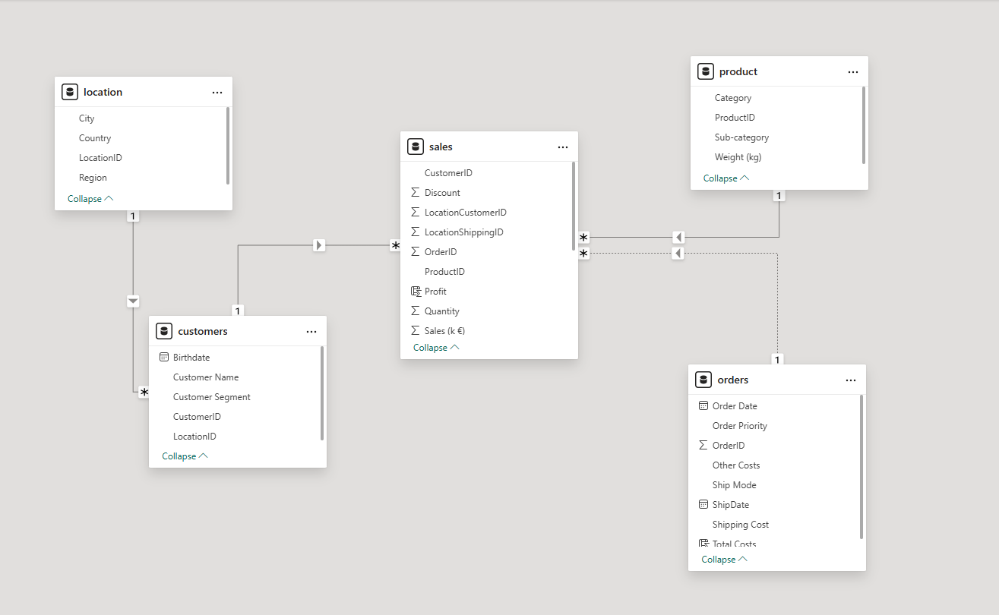
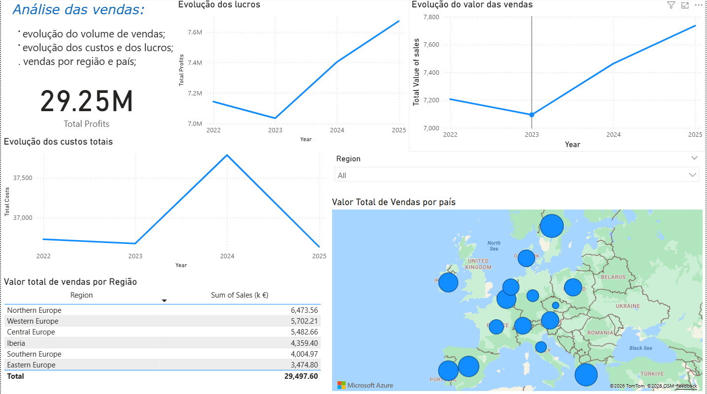
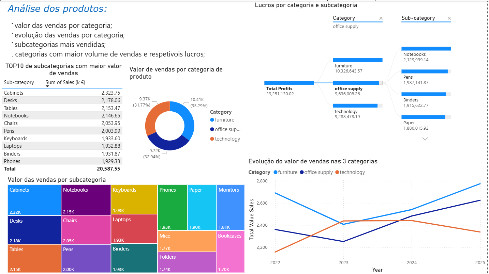
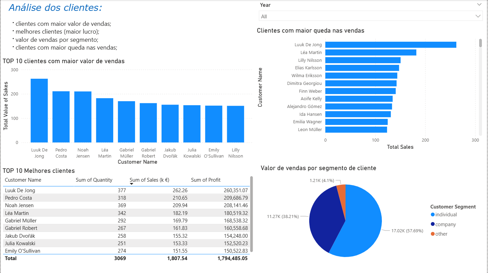

# PowerBI_Viva-Office_Dashboard
# Power BI – Viva Office Dashboard

## 📌 Project Overview
This academic project consists of an interactive Power BI dashboard developed using **fictional sales data** from a company in the office supplies sector.

The dashboard was created for the course **"Technologies for Digital Transformation"**, within the subject **Foundations of Business Intelligence**.

## 🎯 Objective
to :
- Monitor overall sales performance
- Identify high-performing products and customers
- Analyze sales trends over time
- Support data-driven decision making

## 📊 Key Insights & Visuals

### 📈 Relational Model
The data model was designed following a star schema to ensure optimal performance
and clear relationships between fact and dimension tables.

### 🔎 Sales Overview

### 📦 Products Analysis

### 🌍 Customers Analysis

## 🛠 Tools & Technologies
- Power BI
- Power Query
- DAX
- Data Modeling

## 🧠 Skills Demonstrated
- Data cleaning and transformation
- KPI definition
- Visual storytelling
- Dashboard usability and clarity

## ✅ Notes
All data used in this project is **fictional and created for academic purposes**.

